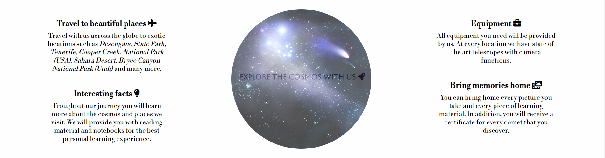

# Comet Hunters

Comet Hunters is a site for those who wish to explore the cosmos as close as possible without having to be an actual astronomer. The main idea is to aid those who might have the desire to learn and explore but lack the means to do so. The club organizes trips across the globe and takes care of food, lodging, equipment and planning so that those who sign up can focus on peering into the vastness of space. The focus is as much on learning as it is having fun, and the most important thing, regardless of which package you choose, will always be to create beautiful memories.

Those who wish to sign up can choose from three different premade packages. The differences in the packages lies in the number of locations you get to visit and what resources will be at your disposal throughout the journey. They, of course, also differ in price range because of this, and having three different packages will ensure that most people will be able to find a package that matches their level of interest and capital.

## Features

* Navigation Bar
  - A fully responsive navigation bar with a logo, that when clicked takes the user back to the main page, as well as separate links to the three different parts of the site.
  - It appears on all pages and remains the same regardless of which page the user is on, which makes navigation easy and prevents the user from getting lost.
  - Removes the need to use the browser's built-in "back" and "forward" buttons.

* The Landing Page Image
  - A static but eye-catching image that immediately tells the user what the theme of this site is. 

* The Cosmos Club Section
  - The main part of the landing page where the user will be informed about what, exactly, the Cosmos Club does. 
  - Brings the users attention to the many benefits and amazing experiences that comes with signing up in four short, and easy to read, paragraphs. 
  - Spurs the users interest by giving examples of travel destinations and some perks that are available without revealing everything.

* Footer
  - Contains links to all of the social media sites that the Cosmos Club has.
  - Just like the navigation bar it remains the same throughout the entire site, is fully responsive and is present on all pages.
  - Encourages the user to engage with the Cosmos Club, as well as seek more information, in a multitude of ways.

* Gallery
  - Shows pictures from earlier trips around the globe and contributes to giving the user a clear idea of what to expect.
  - The gallery is fully responsive and adjusts its presentation by limiting the number of rows it has based on the users screen size.
  - Every picture has a description beneath it that tells the user where the picture was taken.

* The Sign Up Page
  - Lets the user sign up and get in contact with the Cosmos Club by providing some basic personal information.
  - Presents three options to the user in three easy to read bubbles (or boxes depending on screen size).
  - Both the form and the information bubbles are responsive and adapts to the users screen size.

### Features left to implement
* A hamburger menu in the nav bar that when clicked opens up a more detailed "About us" section.

## Testing

* The site has been tested on the following browsers: Firefox, Google Chrome and Microsoft Edge.
* I can confirm that the entire site is responsive and adapts to all common screen sizes.
* I can confirm that every piece of text, as well as the form and the navigation links, are readable and easy to understand.
* I have tested all of the links and can confirm that they are working as intended (external links opening in new tabs etc.).
* I can confirm that the form is working as intended: it lets the user know what information is required, the email input only accepts a valid email format, the submit button works as intended and the correct information is sent to the server.

### Validator Testing

* HTML
  - No errors were returned when passing through the official [W3C HTML Validator](https://validator.w3.org/nu/?doc=https%3A%2F%2Fraluca59.github.io%2Fcomet-hunt%2Fsignup.html).

* CSS
  - No errors were returned when passing through the official [W3C CSS Validator](https://jigsaw.w3.org/css-validator/validator?uri=https%3A%2F%2Fraluca59.github.io%2Fcomet-hunt%2Fsignup.html&profile=css3svg&usermedium=all&warning=1&vextwarning=&lang=en).

* Lighthouse
  - I used Lighthouse in devtools to confirm that the accessibility and performance of the site is at an acceptable level.

### Unfixed bugs

* There are no unfixed bugs.

## Deployment

* The site was deployed to GitHub pages. To deploy one must follow these steps:
  1. Enter the GitHub repository.
  2. Find the "Settings" tab and click it.
  3. Find the "Pages" tab and click it.
  4. Find the "Select branch" drop-down menu under the "Branch" heading.
  5. Choose "main" in the drop-down menu and save.
  6. Wait a short while and refresh the page in order to receive a url and a link to the newly deployed site.

* The live link can be found [here](https://raluca59.github.io/comet-hunt/)

## Credits

### Content

* The icons on the landing page, in the footer and on the form are taken from [Font Awesome](https://fontawesome.com/).

### Media

* The images, except the landing page image, are taken from [Pexels](pexels.com).
* The Landing page image is taken from [Alphacoders](https://wall.alphacoders.com/tag/comet-wallpapers).

